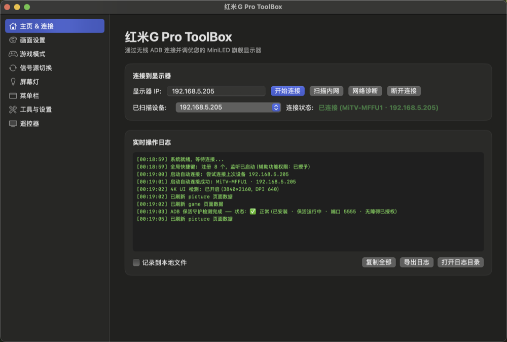
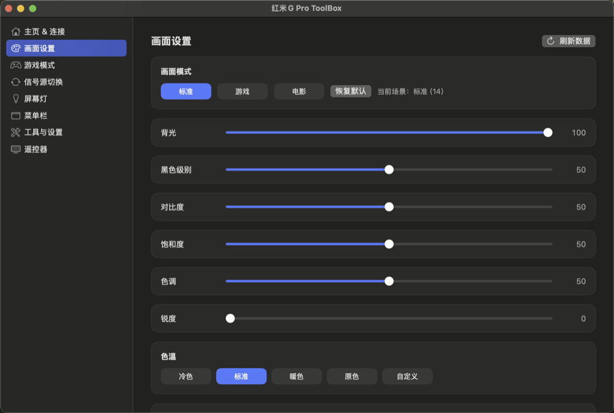
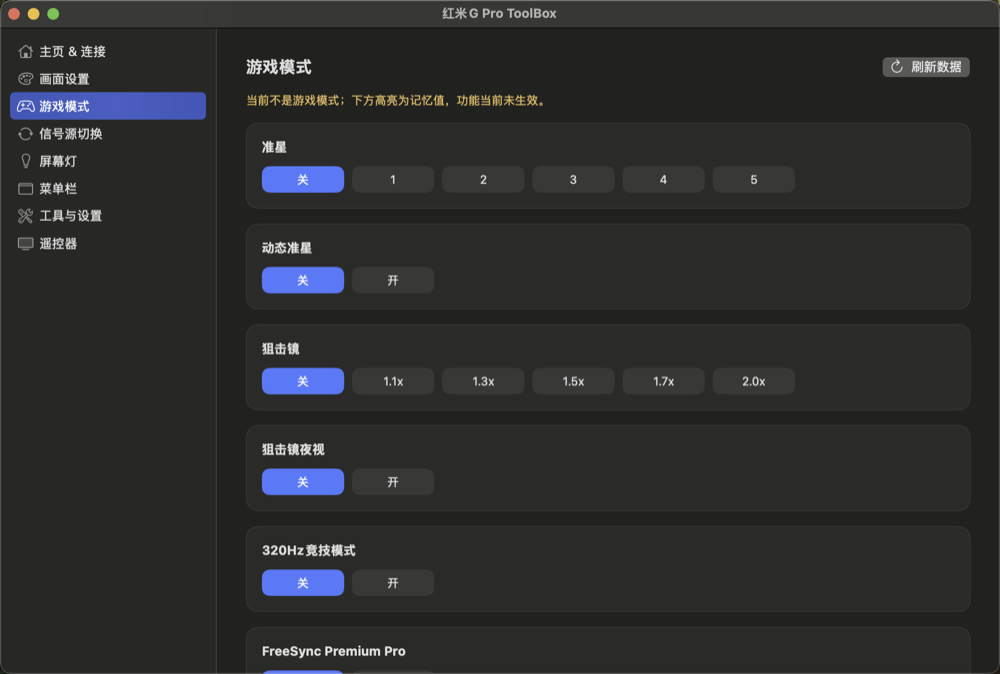
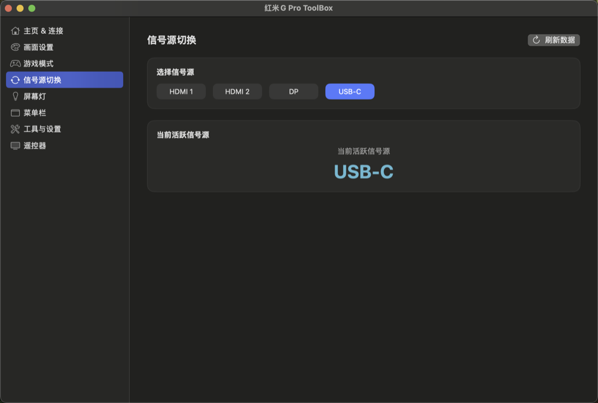
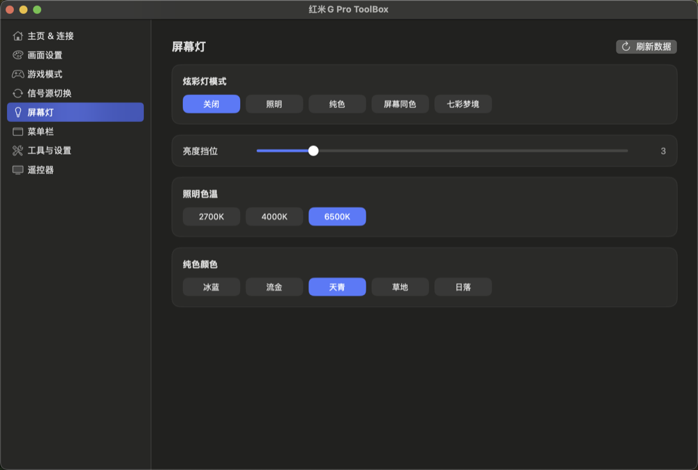
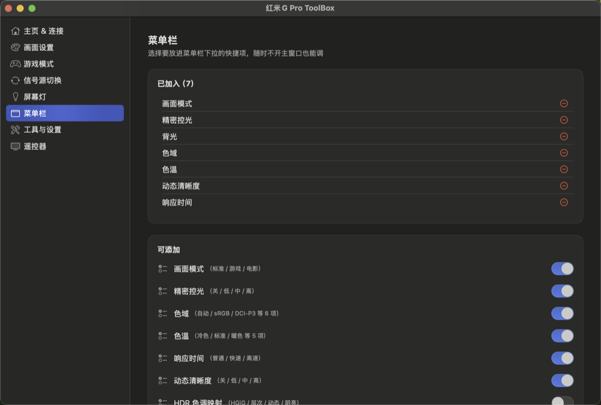
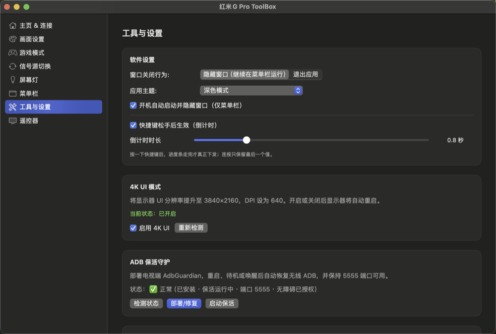
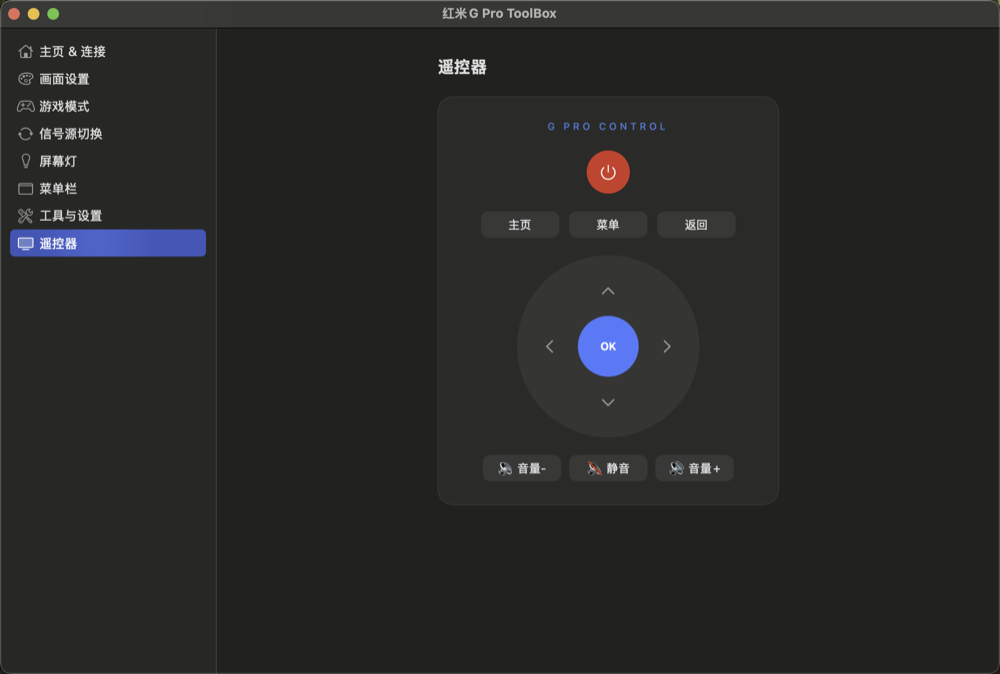
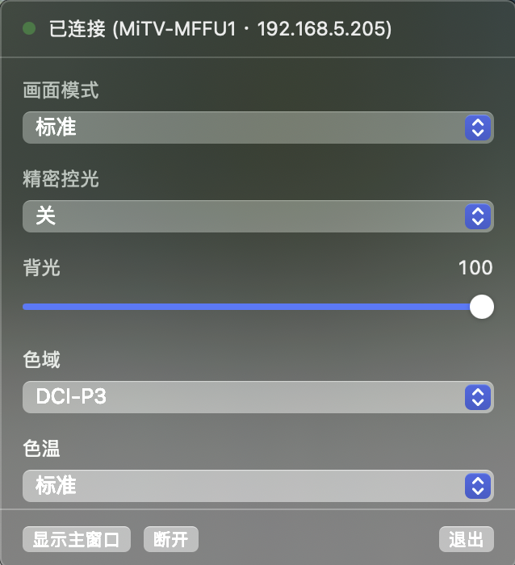

# 红米G Pro ToolBox — macOS (SwiftUI)

红米 G Pro 27U 2026 显示器的原生 macOS 控制工具。这是原 PyQt6/Windows 版的 SwiftUI 移植，
UI 结构与交互逐页对齐 `mimonitor_toolbox/pages.py`，ADB 协议层对齐 `mimonitor_toolbox/adb.py`。

> **命名**：对外的名字统一是「红米G Pro ToolBox」—— .app 的目录名、DMG 名、
> 卷标、菜单栏、权限弹窗里显示的都是它。但有两个**内部标识保持英文、不要改**：
>
> | | 值 | 为什么不能改 |
> | --- | --- | --- |
> | bundle id | `com.mimonitor.toolbox` | 辅助功能 / 本地网络 / 保存的 IP 和快捷键配置都挂在它上面 |
> | 可执行文件名 | `MimonitorToolbox` | 必须与 `Package.swift` 的产物名和 `Info.plist` 的 `CFBundleExecutable` 三者一致 |
>
> `.app` 就是个目录，目录名叫什么系统都不看，所以改中文没有任何副作用。
> 唯一的影响：**已经授权过的机器改名后会重新问一次权限**（路径变了），
> 重新点一次允许即可 —— bundle id 和签名身份没变，所以能再次授予。

## 软件截图

均为深色模式（`assets/screenshots/`）。

| | |
| --- | --- |
| **主页 & 连接**<br> | **画面设置**<br> |
| **游戏模式**<br> | **信号源切换**<br> |
| **屏幕灯**<br> | **菜单栏**（macOS 独有）<br> |
| **工具与设置**<br> | **遥控器**<br> |

**菜单栏面板**（点顶栏图标展开，不用开主窗口就能调）：



## 运行前提

**只对「从源码构建」的人有要求；最终用户直接双击 .app 即可，无需装任何东西。**

从源码构建需要一个条件：**Xcode 命令行工具**（`xcode-select -p` 能返回路径即可）。
adb 不需要预先安装 —— `build_app.sh` 会自动从 Google 官方下载并内嵌进 .app。
显示器需已开启无线 ADB（端口 5555）。

## 编译 / 运行

```bash
cd macos
swift build                  # 编译
swift run MimonitorToolbox   # 运行（开发调试）
```

### 打包成可分发的 .app（无需 Xcode）

```bash
cd macos
./build_app.sh
open "红米G Pro ToolBox.app"
```

默认产出**通用二进制**（Intel + Apple Silicon）。做法是分架构各编一次再 `lipo` 合并 ——
`swift build --arch arm64 --arch x86_64` 那种写法依赖 xcbuild（完整 Xcode），
只用命令行工具会报错。想加快本地构建可以 `UNIVERSAL=0 ./build_app.sh`。

脚本做 5 件事：

1. `swift build -c release`；
2. 组装 `.app` 目录结构；
3. **内嵌全部运行时资源** —— `adb`（仓库没有就自动从 Google 官方下载，缓存在
   `macos/.cache/`，只在首次联网）、`MtkDirectTool.jar`、`ColorfulLedTool.jar`、
   `adbguardian-signed.apk`、adb 的 NOTICE；
4. 生成 `Info.plist`；
5. 清理隔离属性并 ad-hoc 签名（adb 保留 Google 自带的 Developer ID 签名）。

产物是 **`macos/红米G Pro ToolBox.app`** 和 **`macos/红米G Pro ToolBox.dmg`**（直接放在 macos
目录下，方便 Finder 里看到；已在 `.gitignore` 中排除，不会进版本库）。
约 20MB，**自包含、零外部依赖**：

```bash
./reinstall.sh --no-build              # 本机安装到 /Applications 并重启
# 分发给别人：把 .dmg 发过去，对方双击挂载后把 app 拖进 Applications 即完成安装，
# 不需要 adb / brew / Python
```

> 想固定 adb 版本而不走自动下载：把 macOS 版 `adb` 放到仓库根的 `assets/runtime/adb`，
> 脚本会优先使用它。

### 分发注意（Gatekeeper）

用 `setup_signing_cert.sh` 建的**自签名证书**签名（不是 ad-hoc），但没有 Apple 公证。
别人拿到 DMG / zip 后，macOS 会打上隔离属性并提示「无法验证开发者」，
需要对方在 **系统设置 → 隐私与安全性** 里点「仍要打开」一次。

**为什么必须用固定证书而不是 ad-hoc**：macOS 15 起访问局域网需要「本地网络」权限，
而系统要靠**稳定的代码身份**才能记住授权。ad-hoc 的身份是文件内容哈希、每次编译都变，
系统认不出，于是直接**静默拒绝**（连弹窗都不给）—— 表现是「连不上、也搜不到显示器」，
界面上没有任何提示，极难排查。固定证书的身份是「bundle id + 证书指纹」，跨编译稳定。

**CI 上也必须有这张证书**，否则 runner 走 ad-hoc 分支，发出去的包等于不能用：

```bash
./export_signing_cert.sh --write    # 导出并写进 GitHub Secrets（需 gh 已登录）
./export_signing_cert.sh            # 只导出，打印需要手动跑的命令
```

要两个 Secret：`MACOS_CERT_P12`（base64 的 p12）和 `MACOS_CERT_PASSWORD`。
没配置时 CI 打警告并回退 ad-hoc（fork 提的 PR 走这条路）；
但**校验步骤会在「配了证书却仍打出 ad-hoc 包」时直接失败**，避免带病发版。

要彻底消除 Gatekeeper 提示，需要 Apple Developer Program（$99/年）：Developer ID 签名 +
公证（notarytool），之后双击即可打开。脚本里的签名步骤替换成你的证书即可，其余不变。

## 首次使用注意

- **全局快捷键**需要辅助功能权限：系统设置 → 隐私与安全性 → 辅助功能 → 勾选本应用。
- **开机自启动**（LaunchAgent）写入后需注销/重启登录才生效。
- **HDR/SDR 分区控光记忆**基于 macOS EDR 峰值近似判断 HDR（macOS 无 Windows DXGI 等价 API）。

## 目录结构

```
macos/
├─ Package.swift                  # SPM 清单
├─ build_app.sh                   # 一键打包 .app
└─ Sources/MimonitorToolbox/
   ├─ App.swift                   # @main 入口
   ├─ ContentView.swift           # 侧边栏导航外壳（对应 FluentWindow 左侧导航）
   ├─ Models.swift                # 寄存器映射表 + 选项表（移植自 core.py）
   ├─ AppState.swift              # 连接状态 / 当前值 / 日志 / 全部控制动作
   ├─ NetworkScan.swift           # 内网 5555 扫描（macOS 实现）
   ├─ Backend/AdbClient.swift     # ADB 协议层（settings / JNI / 灯效 / jar 部署 / apk 安装）
   ├─ Platform/
   │  ├─ HotkeyManager.swift      # 全局快捷键（CGEventTap + 按键/修饰键映射）
   │  ├─ HDRDetector.swift        # HDR 检测（EDR 近似）
   │  └─ Autostart.swift          # 开机自启动（LaunchAgent）
   └─ Views/
      ├─ Components.swift         # 卡片、选项按钮组、滑条等通用控件
      ├─ HomeView.swift           # 主页 & 连接 & 日志
      ├─ PictureView.swift        # 画面设置
      ├─ GameView.swift           # 游戏模式
      ├─ SourceView.swift         # 信号源切换
      ├─ LightView.swift          # 屏幕灯
      ├─ ToolsView.swift          # 工具与设置
      └─ RemoteView.swift         # 遥控器
```

## 与原版的差异

| 功能 | Windows 原版 | macOS 移植 |
| --- | --- | --- |
| ADB 连接 / settings get·put / JNI 读写 / 灯效 | ✅ | ✅ |
| 画面 / 游戏 / 信号源 / 屏幕灯 / 遥控器页面 | ✅ | ✅ |
| 全局快捷键 + 可调参数快捷键（RegisterHotKey） | ✅ | ✅（CGEventTap，需辅助功能权限） |
| HDR/SDR 分区控光记忆 | ✅（DXGI） | ✅（EDR 近似判断） |
| FreeSync Pro 模式记忆 | ✅ | ✅ |
| 开机自启动（注册表） | ✅ | ✅（LaunchAgent） |
| ADB 保活守护（AdbGuardian） | ✅ | ✅ |
| APK 安装 / ADB 命令行 / 4K UI | ✅ | ✅ |
| 日志落盘 / 导出 / 打开目录 | ✅ | ✅ |
| 物理网卡枚举 | ✅（IPHLPAPI） | ✅（简化：ifconfig + TCP 探测） |
| 主题切换（跟随系统 / 深色 / 浅色） | — | ✅ |
| 快捷键倒计时（时长可调，可关闭） | — | ✅ |

### macOS 独有的部分

下面这些在 Windows 原版里没有对应物 —— 那边是托盘图标、且没有菜单栏这个概念：

| 能力 | 说明 |
| --- | --- |
| **菜单栏常驻 + Dock 图标按需显隐** | 普通 app 身份（启动台能找到），关掉窗口后 Dock 图标收起、只留顶栏 |
| **菜单栏快捷项**（「菜单栏」页） | 自选把哪些控制放进顶栏下拉：画面模式 / 精密控光 / 色域 / 色温 / 背光… 支持拖动排序 |
| **菜单栏面板** | 顶栏图标下拉是 `.window` 样式的面板 —— 选项型是下拉、数值型是真滑块，不用开主窗口就能调 |
| **悬浮提示（HUD）** | 按快捷键时屏幕底部弹出，带倒计时进度条 |
| **独立 adb 终端** | 「ADB CMD」开的终端里已注入 PATH 与端口，可以直接敲 `adb devices` |
| **主题切换** | `NSApp.appearance` 全局生效，悬浮窗等 AppKit 面板也跟着变 |

## JNI 验证工具

`verify_jni.py` 用来核对「app 显示的值」和「显示器硬件实际值」是否一致：

```bash
cd macos
python3 verify_jni.py     # 需要已连接显示器（adb server 在 5038）
```

它会：

1. 记录所有被测 JNI 键的原始值；
2. 逐个写入不同的值，回读比对；
3. **无条件还原**成原始值（安全）；
4. 打印 settings 侧和 JNI 侧的对照表。

EDID / FreeSync 这类会改变显示器输入信号格式（可能黑屏或改分辨率）的键，只读不写。

### 已知行为

- **色彩增益写入是异步的**，约 0.5s 后才生效。立刻回读会拿到旧值，这不是故障。
- **settings 与 JNI 会漂移**：用户用显示器自带 OSD 改过设置后，`settings get` 的值可能
  与硬件实际状态不符。因此画面页的背光 / 色域 / 色温 / 精密控光 / 响应时间 / HDR 色调映射
  **一律以 JNI 回读值为准**（移植自原版 `device_features.py:1381-1418` 和 `query_setting_or_jni`）。
- **HDR 色调映射只在部分画面模式下存在**（见 `HDR_TONE_MAPPING_PICTURE_MODES`），
  SDR 模式下原版会隐藏该控件，本版同样处理。

## 连接层设计

启动流程：预热 adb server → 0.9s 后自动连接 → 失败则退化为扫描内网。

**实测耗时**：热启动（复用健康 server）约 3s，冷启动（无 server）约 4s。

### 踩过的坑

- **`SO_SNDTIMEO` 在 macOS 上不约束 `connect()`**。连不存在的主机时内核会一直等 ARP
  超时（75s+），扫描 /24 网段时会把线程池占满，结果「什么都扫不到」。
  必须用**非阻塞 connect + poll + 回读 SO_ERROR**（见 `NetworkScan.isTcpOpen`）。
- **`adb connect` 是异步的**：它挂上 TCP 就返回，此时 `get-state` 往往还是 `offline`。
  只查一次会把成功的连接误判为失败，要轮询等它翻转（`waitForDevice`）。
- **监控定时器不能和连接过程并发**。后台健康监控会在发现「未连接」时重启 adb server，
  如果此时正有一次连接在进行，重启会把它打断 —— 表现为「越监控越连不上」、
  冷启动要几十秒。监控在 `.connecting` / `.scanning` 期间必须让路。
- **定位这类问题的前提是不干扰**：从另一个 adb 客户端反复 `get-state` 会打断
  app 正在操作的 server，测出来的现象是假的。测量时只在最后查询一次。

## 页面切换性能

实测（`measure_render.py`，截图对比法）：

| 页面 | 点击 → 画面稳定 |
| --- | --- |
| 主页 & 连接 | ~540 ms |
| 画面设置 | ~500 ms |
| 游戏模式 | ~510 ms |
| 信号源切换 | ~520 ms |
| 屏幕灯 | ~510 ms |
| 工具与设置 | ~530 ms |
| 遥控器 | ~510 ms |

### 关键教训：不要用 SwiftUI 的 `Slider`

画面设置页曾经要 ~1075 ms，是其它页面的两倍。用「临时隐藏滑条」做 A/B 测试后定位到：
**SwiftUI 的 `Slider` 底层是 AppKit 的 `NSSlider`，每创建一个都要向 CoreUI 主题系统
解析 rendition（`CUICoreThemeRenderer::CopyMeasurementsForRendition`，内部是字符串哈希
查找）。6 个滑条就是 500 ms。**

换成自绘的 `FastSlider`（纯 SwiftUI + `DragGesture`）后降到 ~500 ms，与其它页持平。
同理，`Color(nsColor: .controlColor)` 这类 **AppKit 语义色**也会触发 CoreUI 主题解析，
已统一换成 `Theme.card` / `Theme.control`（`Color.primary` 叠加透明度）。

### 关键教训：测量方法本身会骗人

之前用 AppleScript 的 `entire contents` 轮询来判断页面是否画好，测出「画面设置 4.8 秒」。
但**那个查询本身就要 4 秒**（遍历 AppKit 控件、逐个取属性，同样打热 CoreUI），
测出来的几乎全是查询开销。而且它还会污染 `sample` 采样结果，让人误判热点。

改用 `screencapture` 截图对比（60~77 ms 一次，完全不碰辅助功能树）才拿到真实数据。
`measure_pages.py` 里的 AppleScript 查询版本仅用于驱动点击，**耗时数据不可信**。

## FreeSync Pro 模式记忆只认三个标准模式

开启 FreeSync 前会记下当前画面模式，关闭后切回去。**但只记「标准 / 游戏 / 电影」这三个**
（`RegisterMap.modeNames`），其它模式一律不记、也不还原 —— 记录时遇到非标准模式还会
把旧值清掉，避免留下过期的记忆。

原因是 `picture_mode` 这个字段里混了两类含义完全不同的值：

| 类型 | 例子 | 还原有意义吗 |
| --- | --- | --- |
| 信号驱动（显示器自己切的） | Dolby Vision `11–13/18/19`、HDR 系列 `15–17/22–23/29–33` | ❌ 信号一变显示器又会切走，强行还原还可能和当前信号不匹配 |
| 用户手选 | 游戏子模式 `25–28` | ✅ 有意义 |

光看数值分不出属于哪一类 —— 同一个 `29` 在场景名里是「HDR 游戏 FPS」，
在信号源 id 里却是「DP」。所以先只覆盖三个标准模式，
真遇到需要还原非标准模式的场景再按实际情况加白名单。

> 曾经存过一个 `18`（Dolby Vision IQ）—— 那是早先版本按旧逻辑记下的，
> 属于典型的"信号驱动"模式，正是这条规则要排除的。

## 界面外观

「应用主题」选项（跟随系统 / 深色 / 浅色）由 `AppTheme` 落地，用 `NSApp.appearance`
而不是 SwiftUI 的 `.preferredColorScheme` —— 前者作用于整个进程，AppKit 部分
（悬浮窗的 NSPanel、菜单栏下拉等）也跟着变；后者只影响被修饰的那棵 SwiftUI 视图树，
面板会漏掉。

> **教训**：工具页里有两个选项曾经是「只存储不生效」的 —— 主题、窗口关闭行为。
> 加选项时容易只接上 `@AppStorage` 就以为完事，实际没有任何地方读它。
> 现在的做法是：存储 + 在启动与变更处各应用一次。

## 菜单栏常驻与 Dock 图标

应用**不设 `LSUIElement`** —— 保持普通 app 身份，启动台和 Dock 都认得它。
Dock 图标的显隐由 `DockVisibility`（`App.swift`）在运行时按「有没有可见窗口」切换：

| 状态 | 激活策略 | 表现 |
| --- | --- | --- |
| 主窗口开着 | `.regular` | Dock 里有图标，Cmd+Tab 能切 |
| 关掉主窗口 | `.accessory` | Dock 图标收起，只留顶栏图标，进程继续跑 |

既保住「关掉窗口就退回菜单栏」的行为，又不会在启动台里找不到入口 ——
WPS 那类「Dock 也有、菜单栏也有」的软件就是这么做的。

菜单内容：连接状态 / 显示主窗口 / 断开或重新连接 / 退出。
关掉窗口后应用不会退出，继续在后台跑（快捷键、HDR 记忆、保活守护都还在工作）。

「窗口关闭行为」选项由 `AppDelegate.applicationShouldTerminateAfterLastWindowClosed`
落地：选「退出应用」才会在关窗时结束进程。

> **踩过的坑（一）**：这里一开始写的是 `LSUIElement = true`，把「不在 Dock 常驻」
> 理解成了「永远不进 Dock」。那样会被注册成**后台型 app**，启动台 / Dock /
> Cmd+Tab / 强制退出列表全都看不到 —— 用户从 DMG 拖进 Applications 之后
> 根本找不到入口。`常驻 ≠ 永不出现`。

> **踩过的坑（二）**：判定「有没有可见窗口」不能只写 `isVisible && !(is NSPanel)`。
> **菜单栏图标自己也是一个可见窗口**（`NSStatusBarWindow`，不是 NSPanel），
> 会被算进来，于是永远判定「还有窗口」，关掉主窗口 Dock 图标也不消失。
> 改成认标题栏（`styleMask.contains(.titled)`）才对 —— 主窗口有标题栏，
> 菜单栏图标窗口和悬浮提示窗都没有，而且全是公开 API，
> 不必去引用 `NSStatusBarWindow` 这种私有类名。
>
> 排查这条时还顺带发现 `log show` 在这台机器上抓不到任何进程日志
> （拿 Finder 校准也是 0 行），最后是把决策写进 `/tmp/*.log` 文件才看到真相的。

> 图标用 SF Symbol `display` 而不是应用图标 —— 菜单栏图标惯例是单色符号，
> 彩色图标混在 Wi-Fi / 电池那一排里会很突兀。

## 应用图标

直接复用 Windows 版的 `assets/app/icon.ico`，保证两端图标一致：

```bash
./make_icon.sh     # 从 ../assets/app/icon.ico 生成 assets/AppIcon.icns
```

Windows 图标更新后重跑一次即可。脚本把 `.ico` 的各尺寸图层拆出来（大尺寸都是内嵌 PNG），
映射成 macOS 的 `.iconset` 再交给 `iconutil`。源图标最大 256×256，
所以 512/1024 是从它放大的 —— 图标是扁平图形，放大后仍可用。

> macOS 图标惯例是四周留白 + 圆角矩形，而 Windows 这版是**满幅圆形**。
> 现在按原样嵌入，在 Dock 里会比系统图标显得略大。想要更贴近原生观感的话，
> 可以在 `make_icon.sh` 里给图像加一圈留白。

## CI

`.github/workflows/macos.yml`（与原有的 Windows `build.yml` 并存）：

- **触发**：改动 `macos/**` 的 push / PR；打 `v*` 标签（标签不受路径过滤限制）
- **build**：debug 编译 → 通用二进制打包 → 校验产物 → 上传 artifact
- **release**：仅标签触发，把 zip 附到 GitHub Release

校验步骤会逐项确认：可执行文件存在、内嵌 adb / 两个 jar / 保活 apk 齐全、
**确实是 arm64 + x86_64 通用二进制**、签名有效、本地网络权限声明确实写进了 Info.plist、
内嵌的 adb 真的能跑起来。

> CI runner 自带完整 Xcode，所以交叉编译 x86_64 没问题；本机只有命令行工具时也能编
> （实测可以，见上文）。

签名分两种情况：

- **配了 `MACOS_CERT_P12` / `MACOS_CERT_PASSWORD`**（正式发版）：构建前把固定证书
  导进临时钥匙串并加入信任，产物有稳定身份，别人装完才能正常授权本地网络。
  校验步骤会确认产物**不是** ad-hoc 签名。
- **没配**（fork 提的 PR）：回退 ad-hoc，只用于验证能不能编译，不要拿去分发。

导入证书有几处容易漏，都写在 workflow 的注释里：`security set-key-partition-list`
（不设 codesign 会弹 GUI 授权框、CI 上等于永久挂起）、
`security add-trusted-cert`（自签名默认不受信任，不受信任就不算有效身份，
`find-identity -v` 里看不到）、以及 p12 的密码必须是**导出时那个**
（曾经把另一个密码写进 Secret，报 `MAC verification failed during PKCS12 import`）。

## 全局快捷键

基于 `CGEventTap`（`.cgSessionEventTap` + `.defaultTap`），需要**辅助功能权限**。

### 授权流程

1. app 启动时若「配了快捷键但未授权」，调用 `AXIsProcessTrustedWithOptions(prompt: true)`
   弹系统框引导。**每个 app 只会弹一次**，拒绝之后只能靠深链：
   `x-apple.systempreferences:com.apple.preference.security?Privacy_Accessibility`
2. 用户在「系统设置 → 隐私与安全性 → 辅助功能」里勾选
3. **必须重启 app** —— 实测切回前台刷新仍读到未授权，重启后立刻生效。
   TCC 的授权结果是进程启动时读取的。

### 踩过的坑

- **ANSI 按键码不是按字母/数字顺序排的**。字母按 QWERTY 物理位置（`A=0x00, D=0x02,
  C=0x08, B=0x0B, E=0x0E`），数字也乱序（`1=0x12, 2=0x13, 4=0x15, 6=0x16, 5=0x17,
  9=0x19, 7=0x1A, 8=0x1C, 0=0x1D`）。早先按 `kVK_ANSI_A + 偏移` 硬算，
  导致**所有字母/数字快捷键都匹配不上**（只有 F1-F12、方向键能用）。
  必须逐个列出（见 `HotkeyMap.ansiTables`）。
- **事件监听会被系统临时禁用**。回调执行太慢时 tap 会被 disable，且表面上看不出来
  （tap 还在，只是收不到事件）。必须处理 `tapDisabledByTimeout` 并
  `CGEvent.tapEnable(tap:enable:true)` 重新启用。
- **`tapCreate` 失败会返回 nil 且不报错**。不检查的话表现就是"配了完全没反应"，
  所以 `start()` 返回 Bool 并把结果写进日志。

### 悬浮提示（HUD）

按快捷键时在屏幕底部弹出提示，对齐原版 `widgets.py` 的 `OsdHud`：
360×112、距底部 150px、深色圆角框 + 投影，标题 13px 粗体、数值 20px 特粗 #0078d4，
显示 1.8 秒后 250ms 淡出。

界面用 **SwiftUI** 画（`NSHostingView` 塞进 `NSPanel`）。用 NSPanel 而不是 SwiftUI
Window 是因为需要 `.nonactivatingPanel`（不抢焦点）+ `.borderless`（自绘圆角）+
跨全屏空间可见。数据用 `ObservableObject` 驱动，反复显示只走 SwiftUI 差异更新。

底色用 93% 而非原版的 84% —— 悬浮窗常压在文字密集的窗口上，太透会影响读数。

**底部有一条倒计时进度条**（原版没有）：连按落在 450ms 节流窗口内时，
显示"还有多久才会真正下发"。没有它的话这段等待看起来像卡住；有了它，
等待变成了一个明确的、可预期的过程。

### 连按要防抖，但必须是「前沿 + 尾部」

循环切换和可调参数都走 450ms 节流，**但不能是纯尾部防抖**。

原版用的是纯尾部（`timer.start()` 每次重置）：任何一次按键都要等停手 450ms 才生效，
**单按一次也白等 450ms**，手感就是"迟滞"。本版改成：

- **前沿**：距上次下发超过 450ms → 本次**立刻生效**，单按零延迟
- **尾部**：窗口内的连按只推进 HUD 预览和界面，停手后补发最终值

实测：慢速按 3 次各在 130~200ms 内生效（含测量开销）；快速连按 5 次推进 5 步、
ADB 只写 1~2 次。JNI 通道单次要 0.5~1 秒，不合并的话长按会堆积好几秒才追上。

### 快捷键配置要放独立 sheet，不要内联折叠

内联的 `DisclosureGroup` 展开会改变整页高度，**触发工具页上十个卡片全部重新布局**。
采样显示热点是 SwiftUI 的依赖图全量重算（`AG::Graph::update_attribute` /
`input_value_ref_slow` / `AGGraphGetValue`），实测展开要 850ms。
挪进独立 sheet 后只影响那个小面板。

顺带把「修饰键下拉 + 55 项按键下拉」换成**单个录入按钮**（点一下直接按组合键，
修饰键和主键一起录）。原来的 8 行 × 2 个 Picker 在展开时要建 9 个 `NSPopUpButton`，
而且 55 项的长列表里翻找本来就难用。

> 注意：用 `entire contents` 这类 AX 查询去测「展开耗时」会得到偏大的结果 ——
> 它会强制 SwiftUI 为每个新元素构建无障碍节点（采样热点全是
> `AccessibilityNode.*` / `SwiftUIAccessibilityTextResolver`）。
> 那次测出 1752ms，纯截图测只有 1055ms。

### 改动后的刷新必须合并

改画面模式会连带换掉一整套画面参数，所以要在 1.2 秒后重读真实值
（原版 `_refresh_picture_page_after_mode_switch`）。**但每次改动都排一个刷新是灾难**：
一次全文刷新是 21 个 settings + 6 个 JNI 键，还要重绘整页；连按 10 次快捷键就排 10 次，
ADB 通道被占满，要卡几十秒。

原版用 `_picture_mode_switch_seq` 丢弃过期结果；本版用 `scheduleCoalescedRefresh`
直接**取消上一次还没执行的刷新**，只保留最后一次。

实测连按 10 次画面模式：刷新从 ~10 次降到 **1 次**。

> 定位这条的线索来自用户："直接发 adb 命令不卡，按快捷键才卡"。
> 直接改一个 setting 不会触发刷新所以不卡 —— 这把范围直接缩小到了刷新上。

### 排查"卡"时先怀疑测量工具

曾判定"连按卡顿是 SwiftUI 重排导致的"，但对照实验推翻了：

- 单次 `keysend` 进程启动就要 **120ms**（发 20 次自身耗时 4.4s）
- **app 未运行时**发 20 次 = 4.4s，**app 运行时** = 4.6s → app 只占 0.2s
- 采样显示主线程 **99% 时间阻塞在 `mach_msg2_trap`**（等事件），完全是空闲的

所以那次"卡"的测量结果几乎全是测试工具的进程启动开销。
真键盘不会经过这层。

### 循环动作的当前状态必须现读设备

`freesync_toggle` 这类"开关式"动作，如果拿缓存的 `currentValues[...]` 判断当前状态，
JNI 回读偶发失败会把缓存留在 0，于是每次都算出"要开启"→ 按了没反应。
一律改成**动作前先读设备真实值**（见 `toggleFreesync()`）。

## 性能注意

页面刷新分两阶段上屏：

1. `settings list global` 一次拿回全部 global 设置（~0.08s）→ 立即显示、撤掉 loading 遮罩；
2. JNI `batchGet`（~0.9s，瓶颈是设备端启动 `app_process`）→ 到达后静默修正漂移的值。

对比数据（画面页 21 个设置键 + 6 个 JNI 键）：

| 读取方式 | 耗时 |
| --- | --- |
| 逐个 `settings get`（21 次 adb 进程） | 2.29s |
| 一条 shell 循环（21 次设备端进程） | 0.94s |
| **`settings list global`（一次往返）** | **0.08s** |
